## Bmob旧版即时通讯服务

**注：官方已不再对其进行维护，使用上如有问题，可导入源码自行调试。**

Bmob即时通讯服务包含了IM聊天所需要的所有核心功能：

- 五种类型的消息任你发：`纯文本、聊天表情、图片、位置、语音`
- 完善的用户管理功能：`注册、登录`
- 完善的好友管理功能：`添加好友、删除好友、获取好友列表、黑名单管理`
- 会话的本地化存储

同时,还增加了以下几大个性功能：

- `支持陌生人聊天`;
- `新增LBS定位`，允许查看附近的人;
- `支持同一账号多处登陆强制下线`;
- `支持消息重发机制`，由网络或者其他原因导致的消息发送失败皆可点击重发;
- `支持消息回执发送`：已发送、已阅读两种状态;
- `支持自定义聊天消息`，便于开发者扩展;
- `新增定时检测服务`，大幅度增加稳定性和及时性，保证百分百到达。

### UI效果

#### Android注册页面


#### Android登录页面


#### Android会话页面

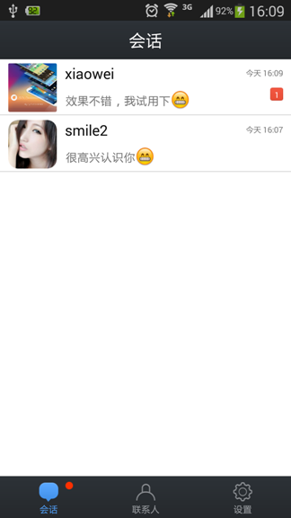


#### Android聊天页面


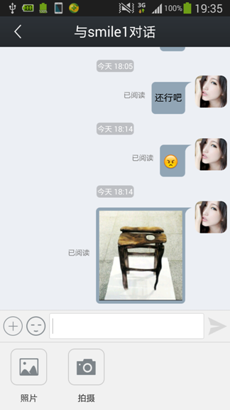


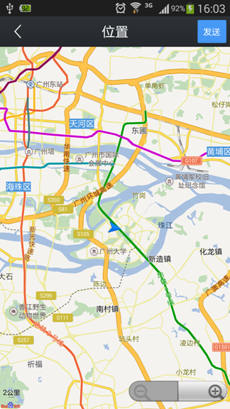

#### Android语音聊天页面

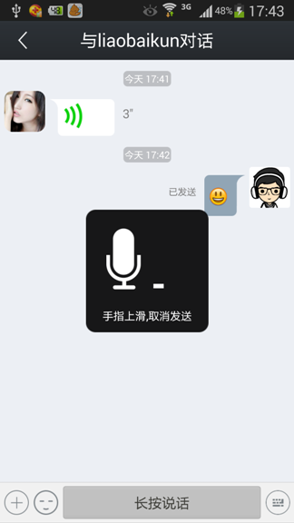


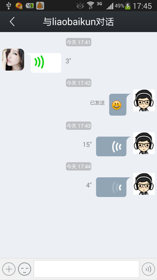


#### Android通讯录页面

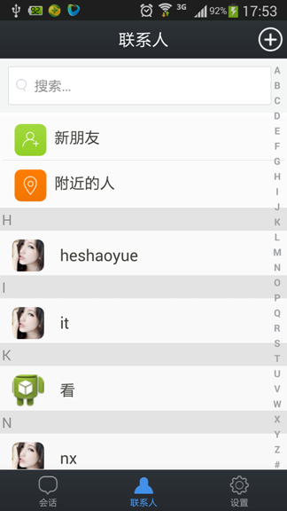

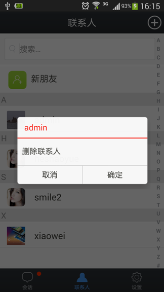

#### Android黑名单页面

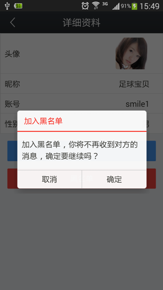


#### Android查找好友页面

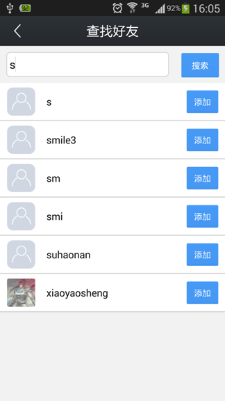

#### Android新朋友页面


#### Android附近的人页面

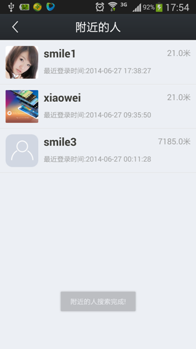

#### Android个人资料页面


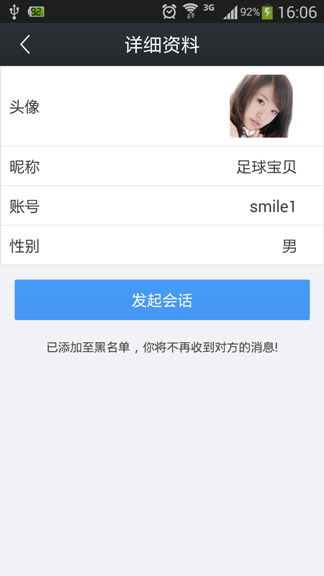


#### Android设置页面

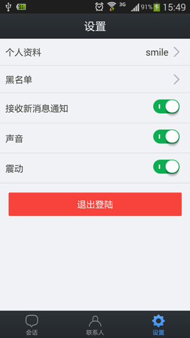


### 快速入门

`BmobIMSDK`是在`Bmob Android SDK`（使用到云数据库、用户管理、文件管理等服务）、`Bmob Push SD`的基础上实现的，因此，想要在自己的应用中快速集成聊天功能，需要获取Bmob平台的`Application ID`。如果你还不知道怎么获取Application ID，你可以先快速浏览[Android快速入门手册](http://docs.bmob.cn/android/faststart/index.html?menukey=fast_start&key=start_android)。

请按照以下步骤完成IM的集成工作：

#### 1、集成IMSDK

1. 导入本Github地址内的`BmobIM_V1.1.9`的library源码工程或者直接下载[Bmob_IM_V1.1.9_20150820.zip]()：其包含IMSDK、BmobSDK以及官方demo。
2. 新建Android工程，将下载下来的官方demo工程中libs下面的BmobIMSDK和配套使用的BmobSDK一起复制到你新建工程的libs。

**注：**

**1、官方demo的libs下面有很多的jar文件，如果你需要Bmob即时通讯服务提供的所有核心功能和个性功能，`建议全部复制`到新建工程的libs下面。当然百度地图这块，开发者可自行替换新版。**

**2、`IMSDK内部集成了Bmob的PushSDK，故你想使用推送功能的话，不再需要导入Push SDK的包啦`。**

#### 2、填写包名

`BmobIM`内部集成了`BmobPush`服务的，所以需要在官网管理后台的`消息推送->推送设置->应用包名`中填写应用的正确包名。

#### 3、 配置AndroidManifest.xml

1. 添加permission：
```xml
    <uses-permission android:name="android.permission.INTERNET" />
    <uses-permission android:name="android.permission.ACCESS_NETWORK_STATE" />
    <uses-permission android:name="android.permission.ACCESS_WIFI_STATE" />
    <uses-permission android:name="android.permission.CHANGE_WIFI_STATE" />
    <uses-permission android:name="android.permission.CHANGE_NETWORK_STATE" />
    <permission
        android:name="cn.bmob.permission.push"
        android:protectionLevel="normal" >
    </permission>
    <uses-permission android:name="cn.bmob.permission.push" />   
```
注：以上只是和BmobIM有关的基础权限，官方demo中的AndroidManifest.xml文件中还有很多其他的权限，如果你需要Bmob即时通讯服务提供的所有核心功能和个性功能，`建议全部复制`。

2. 添加Service、receiver标签：
```xml
  <!-- IM聊天所需的Push start-->
    <service
        android:name="cn.bmob.push.lib.service.PushService"
        android:exported="true"
        android:label="PushService"
        android:permission="cn.bmob.permission.push"
        android:process="cn.bmob.push" >
        <intent-filter>
            <action android:name="cn.bmob.push.lib.service.PushService" />
        </intent-filter>
    </service>

    <receiver android:name="cn.bmob.push.PushReceiver" >
        <intent-filter android:priority="2147483647" > <!-- 优先级加最高 -->
            <!-- 系统启动完成后会调用 -->
            <action android:name="android.intent.action.BOOT_COMPLETED" />
            <!-- 解锁完成后会调用 -->
            <action android:name="android.intent.action.USER_PRESENT" />
            <!-- 监听网络连通性 -->
            <action android:name="android.net.conn.CONNECTIVITY_CHANGE" />
        </intent-filter>
    </receiver>
   <!--聊天消息接收器 -->
    <receiver android:name=".MyMessageReceiver" >
        <intent-filter>
            <action android:name="cn.bmob.push.action.MESSAGE" />
        </intent-filter>
    </receiver>

    <!-- IM聊天所需的Push end-->
    
    <!-- 个性功能中的启动定时检测服务，可选功能 -->
     <service android:name="cn.bmob.im.poll.BmobPollService">
        <intent-filter>
            <action android:name="cn.bmob.im.service.BmobPollService"/>
        </intent-filter>
    </service>
```

#### 4、初始化

在应用的启动页的onCreate方法中完成初始化，可同步设置调试模式，方便开发者调试，正式发布时需注释。

```
	protected void onCreate(Bundle savedInstanceState) {
		//可设置调试模式，当为true的时候，会在logcat的BmobChat下输出一些日志，包括推送服务是否正常运行，如果服务端返回错误，也会一并打印出来。方便开发者调试，正式发布应注释此句。
		BmobChat.DEBUG_MODE = true;
		//BmobIM SDK初始化--只需要这一段代码即可完成初始化
		BmobChat.getInstance(this).init(Config.applicationId);
		//省略其他代码
	}
```

注：

1. 初始化方法包含了BmobSDK的初始化步骤，故无需再初始化BmobSDK
2. 详细代码请查看`SplashActivity.java`文件和`Config.java`。


#### 5、注册消息接收器

```
public class MyMessageReceiver extends BroadcastReceiver {

	// 事件监听
	public static ArrayList<EventListener> ehList = new ArrayList<EventListener>();

	@Override
	public void onReceive(Context context, Intent intent) {
		String json = intent.getStringExtra("msg");
		BmobLog.i("收到的message = " + json);
		//省略其他代码
	}
}
```

**注：**

** 1、`MyMessageReceiver.java`类中负责的是最重要的消息处理这块的功能，建议`全部复制`。**

** 2、如果你使用了IM SDK，又需要推送的功能，那么你无需修改任何东西，消息的发送可以参考推送文档。**

说明如下：

**1、`无须添加BmobPush的jar包`，因为im内部已经集成了push服务;**

**2、`无须添加push的初始化代码`，因为im的初始化代码包含了Push服务的初始化操作。**


### 核心功能

#### 用户管理

##### 注册

由于每个应用的注册所需的资料都不一样，故IM sdk未提供注册方法，用户可按照bmod SDK的注册方式进行注册。

但注册完的回调onSuccess方法中必须添加如下代码来完成设备与用户之间的绑定操作：

`userManager.bindInstallationForRegister(bu.getUsername())`

示例如下：

```
	final User bu = new User();
	bu.setUsername(name);
	bu.setPassword(password);
	//将user和设备id进行绑定aa
	bu.setSex(true);
	bu.setDeviceType("android");
	bu.setInstallId(BmobInstallation.getInstallationId(this));
	bu.signUp(RegisterActivity.this, new SaveListener() {

		@Override
		public void onSuccess() {
			// TODO Auto-generated method stub
			// 将设备与username进行绑定
			userManager.bindInstallationForRegister(bu.getUsername());
			//更新地理位置信息，如果需要LBS功能，建议添加此代码
			updateUserLocation();
			//省略其他代码
		}

		@Override
		public void onFailure(int arg0, String arg1) {
			// TODO Auto-generated method stub
			ShowToast("注册失败:" + arg1);
		}
	});
```
更多详细的代码请查看`RegisterActivity.java`文件。

##### 登录

```
	User user = new User();
	user.setUsername(name);
	user.setPassword(password);
	userManager.login(user,new SaveListener() {

		@Override
		public void onSuccess() {
			// TODO Auto-generated method stub
			//更新用户的地理位置以及好友的资料，可自行到BaseActivity类中查看此方法的具体实现，建议添加
			updateUserInfos();
			//省略其他代码
		}

		@Override
		public void onFailure(int errorcode, String arg0) {
			// TODO Auto-generated method stub
			ShowToast(arg0);
		}
	});

```

更多详细的代码请查看`LoginActivity.java`文件。

##### 退出登录

```
	/**
	 * 退出登录,清空缓存数据
	 */
	public void logout() {
		BmobUserManager.getInstance(getApplicationContext()).logout();
		setContactList(null);
		setLatitude(null);
		setLongtitude(null);
	}
```
更多详细的代码请查看`CustomApplcation.java`文件。

#### 好友管理

##### 获取好友列表

```
	userManager.queryCurrentContactList(new FindListener<BmobChatUser>() {
		@Override
		public void onError(int arg0, String arg1) {
			//省略其他代码
		}

		@SuppressWarnings("unchecked")
		@Override
		public void onSuccess(List<BmobChatUser> arg0) {
			// 保存到application中方便比较
			CustomApplcation.getInstance().setContactList(CollectionUtils.list2map(BmobDB.create(LoginActivity.this).getContactList()));
		}
	});
```

为了提升加载速度，获取到的好友列表都加载到本地数据库和内存中。更多详细的代码请查看`LoginActivity.java`文件。

##### 添加好友

```
	//发送TAG_ADD_CONTACT请求
	BmobChatManager.getInstance(mContext).sendTagMessage(BmobConfig.TAG_ADD_CONTACT, contract.getObjectId(),new PushListener() {
		
		@Override
		public void onSuccess() {
			// TODO Auto-generated method stub
			progress.dismiss();
			ShowToast("发送请求成功，等待对方验证!");
		}
		
		@Override
		public void onFailure(int arg0, final String arg1) {
			// TODO Auto-generated method stub
			progress.dismiss();
			ShowToast("发送请求失败，请重新添加!");
		}
	});
```
更多详细的代码请查看`AddFriendActivity.java`和`AddFriendAdapter.java`文件。

##### 删除好友

```
	userManager.deleteContact(user.getObjectId(), new UpdateListener() {
		
		@Override
		public void onSuccess() {
			// TODO Auto-generated method stub
			ShowToast("删除成功");
			//删除内存
			CustomApplcation.getInstance().getContactList().remove(user.getUsername());
			//省略其他
		}
		
		@Override
		public void onFailure(int arg0, String arg1) {
			// TODO Auto-generated method stub
			ShowToast("删除失败："+arg1);
		}
	});

```

更多详细的代码请查看`ContactFragment.java`。

##### 查找某个好友

```
	userManager.queryUserByName(searchName, new FindListener<BmobChatUser>() {
		@Override
		public void onError(int arg0, String arg1) {
			ShowToast("用户不存在");
		}
				
		@Override
		public void onSuccess(List<BmobChatUser> arg0) {
			if(arg0!=null && arg0.size()>0){
				users.addAll(arg0);
				adapter.notifyDataSetChanged();
			}else{
				ShowToast("用户不存在");
			}
		}
	});
```

更多详细的代码请查看`AddFriendActivity.java`文件。

##### 黑名单管理

###### 1）、添加到黑名单
```
	// 添加到黑名单列表
	userManager.addBlack(username, new UpdateListener() {

		@Override
		public void onSuccess() {
			// TODO Auto-generated method stub
			ShowToast("黑名单添加成功!");
			//省略其他
		}

		@Override
		public void onFailure(int arg0, String arg1) {
			// TODO Auto-generated method stub
			ShowToast("黑名单添加失败:" + arg1);
		}
	});

```
更详细的代码请查看`SetMyInfoActivity.java`。

###### 2）、移出黑名单

```
	userManager.removeBlack(user.getUsername(),new UpdateListener() {
					
		@Override
		public void onSuccess() {
			// TODO Auto-generated method stub
			ShowToast("移出黑名单成功");
			//重新设置下内存中保存的好友列表
			CustomApplcation.getInstance().setContactList(CollectionUtils.list2map(BmobDB.create(getApplicationContext()).getContactList()));	
		}
		
		@Override
		public void onFailure(int arg0, String arg1) {
			// TODO Auto-generated method stub
			ShowToast("移出黑名单失败:"+arg1);
		}
	});

```
更详细的代码请查看`BlackListActivity.java`。

#### 消息发送

##### 发送纯文本和聊天表情

```
	// 组装BmobMessage对象
	BmobMsg message = BmobMsg.createTextSendMsg(this, targetId, msg);
	//不带监听回调，默认发送完成，将数据保存到本地消息表和最近会话表中
	manager.sendTextMessage(targetUser, message);
   //带监听回调
   //sendTextMessage(BmobChatUser targetUser,BmobMsg msg, PushListener pushcallback)

```

##### 发送图片

```
	manager.sendImageMessage(targetUser, local, new UploadListener() {

		@Override
		public void onStart(BmobMsg msg) {
			// TODO Auto-generated method stub
			ShowLog("开始上传onStart：" + msg.getContent() + ",状态："
					+ msg.getStatus());
			refreshMessage(msg);
		}

		@Override
		public void onSuccess() {
			// TODO Auto-generated method stub
			mAdapter.notifyDataSetChanged();
		}

		@Override
		public void onFailure(int error, String arg1) {
			// TODO Auto-generated method stub
			ShowLog("上传失败 -->arg1：" + arg1);
			mAdapter.notifyDataSetChanged();
		}
	});

```

##### 发送地理位置

```
	// 组装BmobMessage对象
	BmobMsg message = BmobMsg.createLocationSendMsg(this, targetId,
			address, latitude, longtitude);
	// 默认发送完成，将数据保存到本地消息表和最近会话表中
	manager.sendTextMessage(targetUser, message);

```

##### 发送语音

```
	manager.sendVoiceMessage(targetUser, local, length,new UploadListener() {
	
			@Override
			public void onStart(BmobMsg msg) {
				// TODO Auto-generated method stub
				refreshMessage(msg);
			}
	
			@Override
			public void onSuccess() {
				// TODO Auto-generated method stub
				mAdapter.notifyDataSetChanged();
			}
	
			@Override
			public void onFailure(int error, String arg1) {
				// TODO Auto-generated method stub
				ShowLog("上传语音失败 -->arg1：" + arg1);
				mAdapter.notifyDataSetChanged();
			}
		});

```


注：BmobMsg类是消息发送和接收时的结构组装类，真正的发送还是通过BmobChatManager类来实现的。

五种类型消息发送的详细代码请查看`ChatActivity.java`文件。


##### 删除本地聊天记录

```java

/**删除与指定聊天对象之间的所有消息 
  * @Title: deleteMessages
  * @param  targetObjectId 当前聊天的objectid
  * @return 
  * @throws
  */
BmobDB.create(getActivity()).deleteMessages（String targetObjectId）

```
#### 会话列表

##### 查询全部会话

```
	BmobDB.create(getActivity()).queryRecents();
```

##### 删除会话

```
	//此方法是删除本地会话表中与指定用户之间的会话消息
	BmobDB.create(getActivity()).deleteRecent(String targetObjectId);
	//此方法是删除聊天记录表中的与指定用户之间的聊天记录
	BmobDB.create(getActivity()).deleteMessages(String targetObjectId);
```

会话列表同样是存储在本地数据库中的，可以直接获取，更多详细代码请查看`RecentFragment.java`文件。

### 个性功能

#### 支持陌生人聊天

SDK内部已经支持陌生人聊天了，聊天消息不再局限于好友关系，所以你只需要调用发送消息（上述的五种类型的消息）的方法就行。

#### 查看附近的人

SDK内部提供了两个查询附近的人的方法，支持下拉刷新，具体方法如下：

##### 查询指定范围指定性别的用户列表，允许是否显示自己的好友，默认不显示
```
	//封装的查询方法，当进入此页面时 isUpdate为false，当下拉刷新的时候设置为true就行。
	//此方法默认每页查询10条数据,若想查询多于10条，可在查询之前设置BRequest.QUERY_LIMIT_COUNT，如：BRequest.QUERY_LIMIT_COUNT=20
	//如果你不想查询性别为女的用户，可以将equalProperty设为null或者equalObj设为null即可
	userManager.queryKiloMetersListByPage(isUpdate,0,"location", longtitude, latitude, true,QUERY_KILOMETERS,"sex",false,new FindListener<User>() {

		@Override
		public void onSuccess(List<User> arg0) {
			// TODO Auto-generated method stub
			//省略其他
		}
		
		@Override
		public void onError(int arg0, String arg1) {
			// TODO Auto-generated method stub
			ShowToast("暂无附近的人!");
		}

	});
```

##### 查询所有带地理位置信息的人，不限制地理范围，可指定性别，允许是否显示自己的好友，默认不显示
```
userManager.queryNearByListByPage(isUpdate,0,"location", longtitude, latitude, true,"sex",false,new FindListener<User>() {
		@Override
		public void onSuccess(List<User> arg0) {
			// TODO Auto-generated method stub
			//省略其他
		}
		
		@Override
		public void onError(int arg0, String arg1) {
			// TODO Auto-generated method stub
			ShowToast("暂无附近的人!");
		}

	});
```

更多详细代码请查看`NearPeopleActivity.java`文件

#### 支持消息重发机制

##### 重发文本

```java

BmobChatManager.getInstance(ChatActivity.this).resendTextMessage(targetUser, (BmobMsg) values, new PushListener);

```
##### 重发图片和语音

```java

BmobChatManager.getInstance(ChatActivity.this).resendFileMessage(targetUser, (BmobMsg) values, new UploadListener);

```
更多详细代码请查看`ChatActivity.java`文件

#### 聊天消息允许增加额外字段

如果开发者希望能够增加一些发送过去的消息字段，比如，想加个性别，可根据消息类型使用如下方法发送消息：

如果是`发送文本`，比较特殊：
```
BmobMsg message = BmobMsg.createTextSendMsg(this, targetId, msg);
message.setExtra("Bmob");
manager.sendTextMessage(targetUser, message);
```

如果是`发送图片`，可调用：
```
sendImageMessage(final BmobChatUser targetUser,final String localPath,String extra, final UploadListener uploadCallback)
```

如果是`发送语音`，可调用：
```
sendVoiceMessage(BmobChatUser targetUser,String localPath, int length,	String extra,final UploadListener uploadCallback)
```

#### 允许自定义聊天消息

如果上述这些都不满足你的需求，那么你可以使用：

```
//带监听回调
sendJsonMessage（String json,String targetId,PushListener pushCallback）
//不带监听回调
sendJsonMessage（String json,final String targetId）

```

**注：此方法用于扩展MsgTag，发送自定义格式的消息，这个格式可以随便定义，只负责发送消息，不提供自定义格式的消息的处理，需要开发者自己处理逻辑，比如消息存储等。**

#### 允许自定义通知栏提示语

当收到聊天消息的时候，通知栏默认会显示`XXX（用户名）发来了一个（消息/图片/语音/位置）`，如果开发者想要定制自己的通知栏提示语，可以根据消息类型使用如下方法发送消息：

如果是`发送文本`消息，有两个方法可供选择：

```
//不带监听回调
sendTextMessage(BmobChatUser targetUser,BmobMsg msg, String showAlert)

```
```
//带监听回调
sendTextMessage(BmobChatUser targetUser,BmobMsg msg, String showAlert,PushListener pushcallback）;

```

如果是`发送图片`，可调用：
```
sendImageMessage(BmobChatUser targetUser,String localPath,String extra, String showAlert,UploadListener uploadCallback)
```

如果是`发送语音`，可调用：
```
sendVoiceMessage(BmobChatUser targetUser,String localPath, int length,	String extra,String showAlert,UploadListener uploadCallback)
```

**注：如果你不想填写showAlert的话，可传""或者null值。**


#### 新增定时检测服务

由于受网络和推送服务器的影响，有可能导致聊天消息丢失，用户无法接收到聊天消息，而IM聊天不允许出现聊天消息丢失的情况，故在sdk内部增加了定时检测服务，将未接收到的未读消息再次返回给用户。

##### 开启服务

建议在应用的启动页开启检测服务

```
	//开启定时检测服务（单位为秒）-在这里检测后台是否还有未读的消息，有的话就取出来
	//如果你觉得检测服务比较耗流量和电量，你也可以去掉这句话-同时还有onDestory方法里面的stopPollService方法
	//BmobChat.getInstance(this).startPollService(30);
```

##### 停止服务

```
	//取消定时检测服务
	//BmobChat.getInstance(this).stopPollService();
```
##### 注册接收广播

开启检测服务后，需要在合适的地方注册下面两类广播并完成相应的页面逻辑处理。

###### 注册聊天消息（文本、语音等）的接收广播

```
	private void initNewMessageBroadCast(){
		// 注册聊天消息的接收广播
		NewBroadcastReceiver newReceiver = new NewBroadcastReceiver();
		IntentFilter intentFilter = new IntentFilter(BmobConfig.BROADCAST_NEW_MESSAGE);
		//优先级要低于ChatActivity
		intentFilter.setPriority(3);
		registerReceiver(newReceiver, intentFilter);
	}
```
###### 注册Tag消息（添加好友、下线等）的接收广播：
```
	private void initTagMessageBroadCast(){
		// 注册Tag消息的接收消息广播
	    TagBroadcastReceiver	userReceiver = new TagBroadcastReceiver();
		IntentFilter intentFilter = new IntentFilter(BmobConfig.BROADCAST_ADD_USER_MESSAGE);
		//优先级要低于ChatActivity
		intentFilter.setPriority(3);
		registerReceiver(userReceiver, intentFilter);
	}
```

更多详细代码请查看`MainActivity.java`和`ChatActivity.java`文件

### 常见问题解答

#### 为什么接收不到消息？

-  `是否已填写包名`,因为BmobIM是基于BmobPush服务的，所以需要在官网管理后台的`消息推送->推送设置->应用包名`中填写应用的正确包名;
-  `是否是两台真机测试`：
    1. 模拟器或平板电脑未经过测试，故无法保证其能无法正常接收到消息。
    2. 很多人由于没有两部真机，会采用一个手机注册两个不同的账号，这样来回切换账户来测试聊天，这种方式达不到测试的效果，虽然这一版本的改进使得这种方式能够收到消息，但是及时性比较低。而之前的版本，这种方式是收不到消息的，故不建议这样测试，只有两部真机才能达到真实的聊天效果。
-  `是否安装低版本Push SDK`,因为此IM是基于Bmob推送服务的，而sdk的demo里面也有演示推送服务的例子，但demo里面的BmobPush的sdk版本与IM里面的推送版本不一样，所以，如果安装的话，会影响到Im的消息接收，请卸载后重试;
-  `是否使用的是Android 5.0系统的手机`，在Android 5.0的手机上会出现这样的错误：`Service Intent must be explicit`，最新版本V1.1.8已解决这个问题，可自行下载替换新版SDK。

#### 为什么导入到Eclipse报错？

- 工程所用的编码格式是`GBK`，所以大家导入到eclipse的时候需要自行修改下编码方式;
- 有很多人导入了工程后发现有这个错：`java.lang.IncompatibleClassChangeError: cn.bmob.im.project`，这个是因为BmobIM_V1.1.5是基于BmobSDK_v3.2.8_0105混淆打包的，所以如果你要用的话，这两个包应该是一起导进去的，替换之前的Bmobsdk和BmobIM包。也就是说你不能随便将任意版本的BmobSDK导进来，你能导入的只能是和IMSDK一起发布出去的BmobSDK。

#### 为什么无法发送地理位置信息？

 `请到百度地图官网申请key`。因为demo中的定位以及地理位置用的都是百度的产品，所以需要开发者自行去百度地图官网重新申请map key，然后到AndroidManifest.xml中填写：
```xml
    <meta-data
        android:name="com.baidu.lbsapi.API_KEY"
        android:value="百度地图key" />
```

## Bmob官方信息

官方网址：[http://www.bmob.cn](http://www.bmob.cn)

问答社区：[http://wenda.bmob.cn](http://wenda.bmob.cn)

技术邮箱：support@bmob.cn
